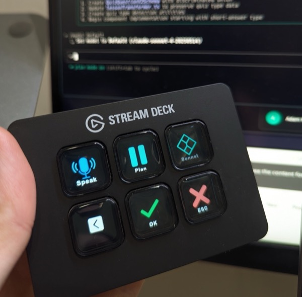
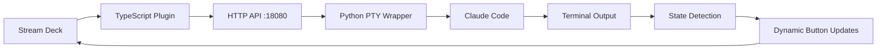

# 🎛️ Claudeck

**Physical buttons for Claude Code. Control Claude instantly from your Stream Deck - no keyboard, no switching windows. See Claude's state at a glance.**




> **🎯 Never leave your keyboard again!** Skip the terminal juggling and control Claude Code with dedicated hardware buttons.

## 📋 Table of Contents
- [Why Claudeck?](#-why-claudeck)
- [Demo](#-demo)
- [Features](#-features)
- [Quick Start](#-quick-start)
- [Architecture](#️-architecture)
- [Usage Examples](#-usage-examples)
- [Development](#️-development)
- [Troubleshooting](#-troubleshooting)
- [FAQ](#-faq)

## 🤔 Why Claudeck?

**The Problem**: Constantly switching between your IDE, terminal, and Claude Code breaks your flow. You're either:
- Alt-tabbing between windows to send commands
- Copying/pasting between applications  
- Losing context while Claude is "thinking"
- Missing important state changes in Claude's interface

**The Solution**: Dedicated hardware buttons that work regardless of what's on your screen.

✅ **Control Claude without focus** - Work in any app while Claude runs in background  
✅ **At-a-glance status** - See current model and edit mode with dynamic button icons  
✅ **Voice + hardware combo** - Use macOS dictation with Stream Deck for hands-free commands  
✅ **One-touch actions** - No more switching windows to press Enter or Escape  

## 🎬 Demo

```
🎥 [Coming Soon: GIF showing Stream Deck buttons controlling Claude in real-time]
```

**Typical Workflow:**
1. Keep working in any app (browser, editor, Slack, etc.)
2. Press **Command** button → Send "git status" (Claude runs in background)
3. Press **OK** button → Accept suggestion (without switching windows)
4. **Shift+Tab** button automatically shows available mode
5. Press **Shift+Tab** → Toggle mode quickly
6. Continue your work while Claude runs - buttons show live status

## ✨ Features

### 🔘 Stream Deck Actions
- **OK Button**: Send Return/Enter key (✓ checkmark icon)
- **Escape Button**: Send Escape key (✗ cross icon) 
- **Mode Button**: Switches between plan, auto-accept, and normal modes
- **Model Button**: Toggles between Opus and Sonnet models
- **Command Button**: Send custom freetext commands


## 🚀 Quick Start

### Prerequisites
- Elgato Stream Deck software
- Claude Code installed and available in PATH
- Python 3.9+ with uv package manager
- Node.js and npm (for plugin development)

### Installation

1. **Install the Python Wrapper**
   ```bash
   git clone https://github.com/codeincontext/claudeck.git
   cd claudeck
   
   # Install globally with uv (development mode for easy updates)
   uv tool install --editable .
   ```
   This makes the `claudeck` command available globally in your PATH.

2. **Install the Stream Deck Plugin**
   ```bash
   # Install Stream Deck CLI tools
   npm install -g @elgato/cli
   
   # Build and link the plugin for development
   cd claudeck-plugin/context
   npm install
   npm run build
   streamdeck link .
   ```
   This links the plugin to Stream Deck for development - changes take effect after rebuilding.

### Usage

1. **Start the wrapper** in any project directory:
   ```bash
   claudeck
   ```

2. **Add actions** to your Stream Deck from the Actions panel

3. **Configure commands** in the Property Inspector for the Command action

## 🏗️ Architecture



### Communication Flow
1. **Stream Deck Plugin** sends HTTP requests to localhost:18080
2. **Python Wrapper** receives commands and forwards to Claude Code via PTY
3. **Claude Code** runs in pseudo-terminal with proper TTY handling
4. **State Monitoring** tracks Claude's mode for dynamic button updates

## 📁 Project Structure

```
claudeck/
├── wrapper/              # Python PTY wrapper
│   ├── claude_deck_wrapper.py
│   └── __init__.py
├── claudeck-plugin/      # Stream Deck plugin (TypeScript)
│   └── context/
│       ├── src/          # TypeScript source
│       └── de.co.context.claudedeck.sdPlugin/
├── tests/                # Test scripts
├── prompts/              # Prompt files and documentation
└── pyproject.toml        # Python package configuration
```

## 🎮 Stream Deck Actions

### Command Examples
Popular commands to configure:
- `git status` - Check git status
- `npm test` - Run tests
- `help` - Show Claude Code help

### API Endpoints

**GET `/state`** - Returns current Claude Code state:
```json
{
  "mode": "interactive", 
  "prompt": "> ",
  "options": []
}
```

**POST `/command`** - Send command to Claude:
```bash
curl -X POST http://localhost:18080/command \
  -H "Content-Type: application/json" \
  -d '{"command": "help"}'
```

## 💡 Usage Examples

### Scenario 1: Code Review Workflow
```
💻 You're browsing documentation in Chrome
1. [Command: "git status"] → Claude checks changes (background)
2. [Command: "review these changes"] → Start Claude review (still browsing)
3. [OK] → Accept Claude's suggestions (no window switching)
4. [Shift+Tab] → Enable auto-accept for similar fixes
💡 Never left your browser!
```

### Scenario 2: Quick Testing
```
1. [Command: "npm test"] → Execute test suite (background)
2. [OK] → Accept changes if tests pass
3. [Escape] → Cancel if tests hang
```

### Scenario 3: Voice Commands (macOS)
```
📱 You're reviewing a design in Figma
1. Press fn+fn (dictation) + [Command button] → "analyze the API response structure"
2. Claude processes in background while you continue designing
3. [OK] → Accept Claude's analysis (still in Figma)
💡 Completely hands-free Claude control!
```


## 🛠️ Development

### Plugin Development
```bash
cd claudeck-plugin/context

# Install dependencies
npm install

# Build plugin  
npm run build

# Restart plugin during development
streamdeck restart de.co.context.claudedeck
```

### Testing
```bash
# Test the wrapper API
python tests/test_wrapper.py

# Test HTTP server functionality
python tests/test_http_server.py
```

### Adding New Actions
1. Create new action class in `src/actions/`
2. Add action to `manifest.json` with UUID and icons
3. Register action in `src/plugin.ts`
4. Build and restart plugin

## 🔧 Troubleshooting

### Common Issues

**Buttons show "Offline"**
- Check if `claudeck` wrapper is running
- Verify Claude Code is installed: `which claude`

**Commands not executing**
- Restart the Python wrapper
- Check if port 18080 is available

**Plugin not loading**
- Check Stream Deck logs in plugin folder
- Restart Stream Deck software: `streamdeck restart de.co.context.claudedeck`

### Debug Commands
```bash
# Restart wrapper
pkill -f claude_deck_wrapper
claudeck

# Check wrapper status
curl http://localhost:18080/state

# Send test command
curl -X POST http://localhost:18080/command -d '{"command":"help"}' -H "Content-Type: application/json"
```

## ❓ FAQ

**Q: Does this work with other AI coding assistants?**  
A: Currently designed specifically for Claude Code's interface patterns. Could be adapted for others.

**Q: What if I don't have a Stream Deck?**  
A: The HTTP API works with any tool that can send HTTP requests. You could build integrations for other macro keyboards or even mobile apps.

**Q: Can I use this on Windows/Linux?**  
A: The Python wrapper should work cross-platform, but the Stream Deck plugin is currently macOS-focused (key sequences may need adjustment).

**Q: Can I add my own custom commands?**  
A: Yes! Use the Command action and configure any text you want to send to Claude. Pro tip: Combine with macOS dictation (fn+fn) for voice commands.

**Q: How does the dictation integration work?**  
A: Configure a Command button, then use macOS dictation (fn+fn) to speak your command. The Stream Deck sends whatever you dictate directly to Claude - no typing required!

## 🎯 Configuration

### Wrapper Options
```bash
claudeck --help
claudeck --port 8080 --quiet
```

### Property Inspector
Configure Command actions through Stream Deck's Property Inspector:
- **Command**: Set custom command text
- **Wrapper URL**: Change API endpoint (default: http://localhost:8080)
- **Show State**: Enable/disable state polling

## 🤝 Contributing

Contributions welcome! Please read our contributing guidelines and submit pull requests.

## 🙏 Credits

- Built for Elgato Stream Deck
- Integrates with Anthropic's Claude Code

---

⭐ **Star this repo** if you find it useful!
